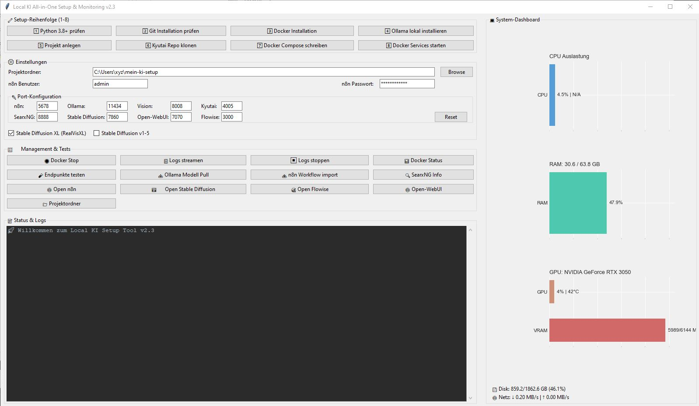

# All-in-One KI- und Automatisierungsplattform

## Beschreibung

Diese Anwendung ist eine benutzerfreundliche GUI (grafische Benutzeroberfläche) zur Verwaltung einer lokalen KI- und Automatisierungsplattform. Sie ermöglicht das einfache Einrichten, Starten, Stoppen und Überwachen mehrerer KI- und Automatisierungsdienste über Docker. Die Plattform integriert verschiedene Tools für Workflows, Sprachmodelle, Bildverarbeitung, Sprachsynthese, Websuche und Bildgenerierung.

## Funktionen

- **Projektstruktur erstellen**: Legt ein Projektverzeichnis mit persistenten Speicherorten für Modelle, Cache und Daten an, einschließlich `.gitignore` für große Dateien.
- **Docker-Management**: Startet und stoppt Docker-Container für alle Dienste mit einer einzigen `docker-compose.yml`.
- **Port-Konfiguration**: Ermöglicht das Anpassen der Ports für alle Dienste über die GUI:
  - n8n Web UI (Default: 5678)
  - Ollama API (Default: 11434)
  - Vision Service (Default: 5000)
  - Kyutai Voice (Default: 8000)
  - SearxNG Web (Default: 8888)
  - Stable Diffusion (Default: 7860)
- **Dienste**:
  - **n8n**: Automatisierung von Workflows mit Web-UI und Workflow-Import.
  - **Ollama**: API für Sprachmodelle mit Modell-Download-Funktion.
  - **Vision Service**: Bildverarbeitung mit persistenten Modellen (YOLO, PyTorch, Hugging Face).
  - **Kyutai**: Sprachsynthese mit persistenten Modellen.
  - **SearxNG**: Datenschutzfreundliche Websuche mit Web-UI.
  - **Stable Diffusion**: Bildgenerierung mit Web-API und persistenten Modellen.
- **Endpunkte testen**: Überprüft die Erreichbarkeit aller Dienste (z. B. Stable Diffusion via `/health`).
- **Logs streamen**: Zeigt Echtzeit-Logs der Docker-Container in der GUI.
- **Projektordner öffnen**: Öffnet das Projektverzeichnis direkt im Datei-Explorer.
- **Web-UIs öffnen**: Öffnet n8n und Stable Diffusion direkt im Browser.
- **Persistente Speicherung**: Speichert Modelle, Cache und generierte Bilder (z. B. Stable Diffusion Outputs) lokal für Wiederverwendung.

## Verwendung

1. **Voraussetzungen**:
   - Windows Build aktualisiert
   - WSL & Virtualisierung aktiviert
2. **Hardware mindest Voraussetzung**:
   - i5 i5-8500
   - mindestens GPU RTX 3050
   - Ram 32 GB