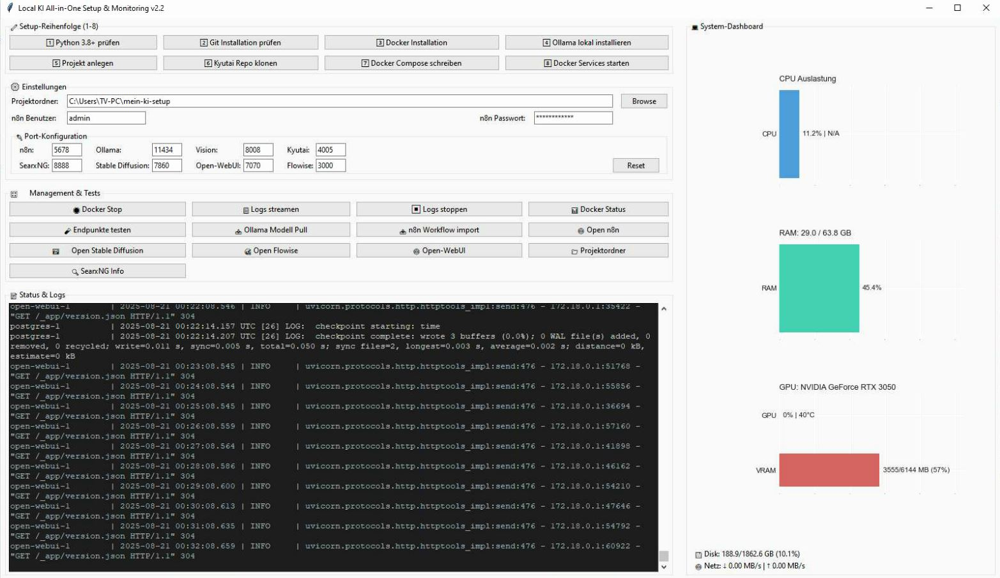

# All-in-One KI- und Automatisierungsplattform
## Beschreibung
Diese Anwendung ist eine benutzerfreundliche GUI (grafische Benutzeroberfläche) zur Verwaltung einer lokalen KI- und Automatisierungsplattform. Sie ermöglicht das einfache Einrichten, Starten, Stoppen und Überwachen mehrerer KI- und Automatisierungsdienste über Docker. Die Plattform integriert verschiedene Tools für Workflows, Sprachmodelle, Bildverarbeitung, Sprachsynthese, Websuche und Bildgenerierung.

## Funktionen
- **Projektstruktur erstellen**: Legt ein Projektverzeichnis mit persistenten Speicherorten für Modelle, Cache und Daten an, einschließlich `.gitignore` für große Dateien.
- **Docker-Management**: Startet und stoppt Docker-Container für alle Dienste mit einer einzigen `docker-compose.yml`.
- **Port-Konfiguration**: Ermöglicht das Anpassen der Ports für alle Dienste über die GUI:
  - n8n Web UI (Default: 5678)
  - flowise (Default: 3000)
  - Ollama API (Default: 11434)
  - Vision Service (Default: 5000)
  - Kyutai Voice (Default: 8000)
  - Stable Diffusion FastAPI (Default: 7859)
  - Visio Difussion WebUI (Default: 7860)
  - SearxNG Web (Default: 8888) (Bonus App)
  - Open-WebUI (Default: 7070)
- **Stable-Diffuse**
  - Select Stable-Diffuser Modul RealVisXL (Default) oder Stable Diffusion v1-5
- **Dienste**:
  - **n8n**: Automatisierung von Workflows mit Web-UI und Workflow-Import.
  - **flowise**: Wie n8n - ohne Lizens Bias und remote Web-Support.
  - **Ollama**: API für Sprachmodelle mit Modell-Download-Funktion.
  - **Vision Service**: Bildverarbeitung mit persistenten Modellen (YOLO, PyTorch, Hugging Face).
  - **Kyutai**: Sprachsynthese mit persistenten Modellen.
  - **SearxNG**: Datenschutzfreundliche Websuche mit Web-UI.
  - **Stable Diffusion**: Bildgenerierung mit Web-API und persistenten Modellen.
  - **Open-WebUI**: Vollumfänglich integrierte ChatGPT-ähnliche Web-Benutzeroberfläche für Ollama-Modelle mit modernster UI/UX.
- **Endpunkte testen**: Überprüft die Erreichbarkeit aller Dienste (z. B. Stable Diffusion via `/health`).
- **Logs streamen**: Zeigt Echtzeit-Logs der Docker-Container in der GUI.
- **Projektordner öffnen**: Öffnet das Projektverzeichnis direkt im Datei-Explorer.
- **Web-UIs öffnen**: Öffnet n8n, Stable Diffusion und Open-WebUI direkt im Browser.
- **Persistente Speicherung**: Speichert Modelle, Cache und generierte Bilder (z. B. Stable Diffusion Outputs) lokal für Wiederverwendung.
## Verwendung ##
1. **Voraussetzungen**:
   - Windows Build aktualisiert
   - WSL & Virtualisierung aktiviert
	1. cmd (mit adminrechten):
	2. dism.exe /online /enable-feature /featurename:Microsoft-Windows-Subsystem-Linux /norestart
	3. dism.exe /online /enable-feature /featurename:VirtualMachinePlatform /norestart
	4. Reboot
	5. cmd (mit adminrechten):
	6. wsl --set-default-version 2
	7. wsl --update --web-download
	8. wsl --install -d Ubuntu
2. **Hardware mindest Voraussetzung**:
   - i5 i5-8500
   - mindestens GPU RTX 3050
   - Ram 32 GB
3. **Zeitaufwand**:
   - Bei Hardware Mindestvoraussetzung 11Mb/s Download dauert das Docker Compose Setup etwa 30 Minuten
   - Falls im Log längere Zeit nichts passiert, Netzwerk- und HD-Traffic im System-Dashboard beobachten!
4. - Ollama wird vom Docker Composer automatisch installiert - Die Windows Variante unter "Punkt 4" ist optional.
**Nicht vergessen, nachdem das Docker Composer Setup durch ist, muss man noch ein llm installieren**
   - Bei Management & Tests "Ollama Modell Pull" vereinfacht machbar.
   - **Open-WebUI** bietet eine intuitive Chat-Oberfläche für alle Ollama-Modelle - perfekt für interaktive KI-Gespräche!
5. - OpenWebUI und SearXNG Anbindung
     1. öffne Projektordner/SearXNG und editiere settings.yml, füge unter formats: - json hinzu, speichern.
     2. öffne http://localhost:7070/admin/settings/web und füge http://localhost:8888 hinzu. Docker neustart!
6. - API Anbindung der Bildgenerierung zu OpenWebUI
     1. Engine AUTOMATIC1111-Basis-URL: http://stable-diffusion:7860
## Kommentar ##
1.  **Projektziel und Idee**
   - Selbsthosten von KI's
   - Turboschnelle und Kinderleichte Installation mit allen gängigen Komponenten
   - Performance-Tests von System mit KIs
   - Unendliche Automatisierungs-Möglichkeiten mit n8n oder flowise - man muss nur wissen wie :)
   - Für Informationsaustausch - n8n/flowise Workflows - Erfahrungen - komm ins > Discord Einladungslink: https://discord.gg/MWSTMVD8
Das Tool wurde für Einsteiger wie mich selbst erstellt - Ich liebe automatismen, und genau dazu sind Computer ja da :)
